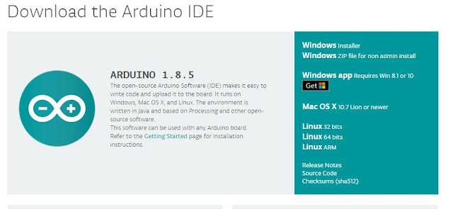
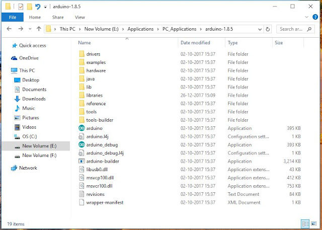
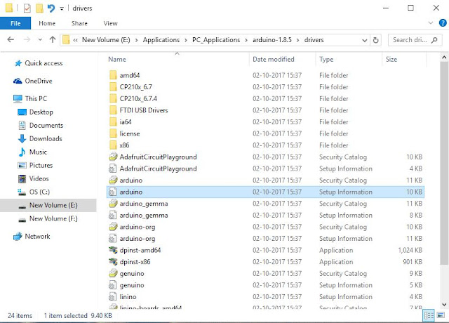
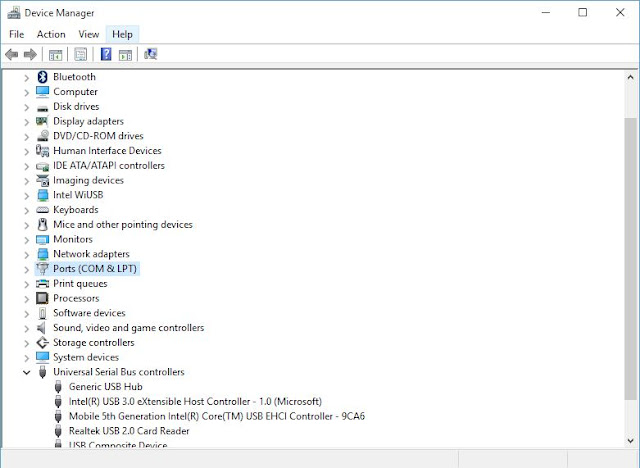
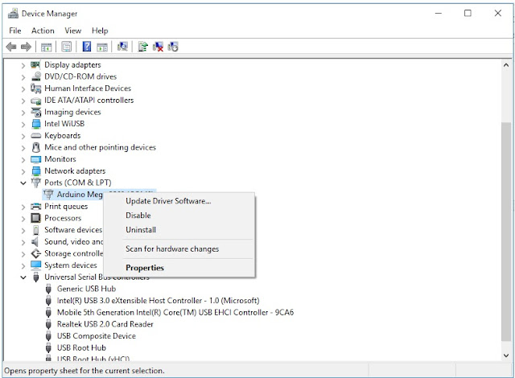
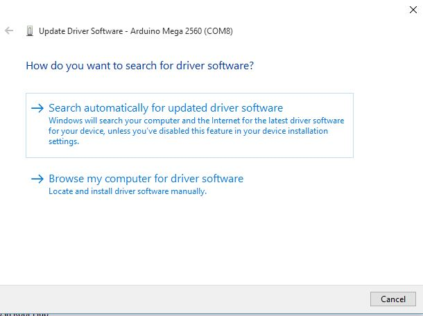
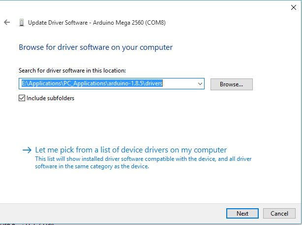

### Setup for Arduino IDE:

#### Installing the Software:

You can download the Arduino IDE from the official site of Arduino https://www.arduino.cc/en/Main/Software. Download the latest version. At the time of writing this post the latest version was version 1.8.5.

<!-- truncate -->

I have downloaded the Windows Zip file for non-admin install.   

Once downloaded, extract the file and you will find the Arduino software in there, no need of any installing procedures.   

If you are connecting your Arduino Board for the first time you will require to install the necessary drivers to make the board compatible .

The drivers are available in the drivers folder in the extracted folder.

Just open it and find the **Arduino.inf** file in it. Copy the path of the drivers folder.   

Now open the Device Manager   

In the device manager, when you connect the Arduino you will find your device name in the Ports(COM & LPT). For eg. Arduino UNO or Arduino MEGA etc. If you cant find your device under Ports(COM & LPT) look under Other Devices.

Once you have found your device, Right click on the device and select Update Driver Software.   

The following window will open   

Select Browse my computer for driver software and browse to the drivers folder or paste the address of the driver software and click Next.   

After this the windows will install the necessary driver and you are ready to go. Connect your device and simply plug and play.
