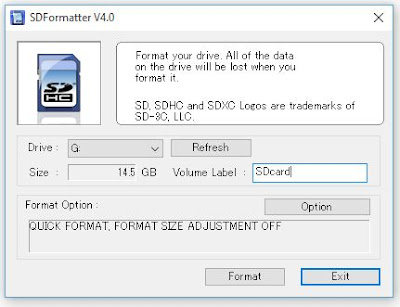
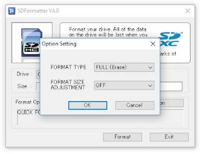
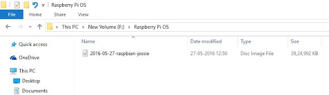
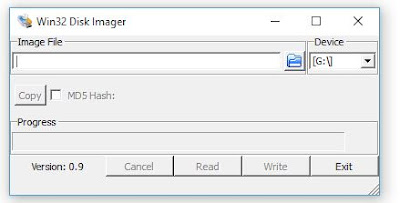
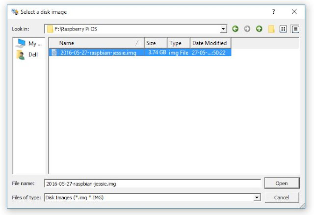
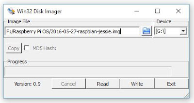
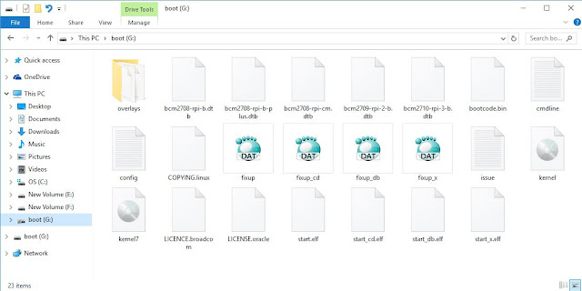
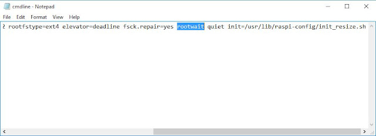
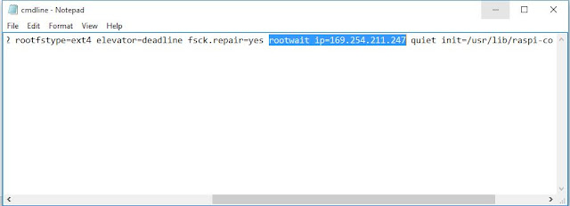

### Installing the Operating System

The first model of raspberry pi was launched in 2011. Since then it has became immensely popular as a low cost computer.

There are many models of the Raspberry Pi from Raspberry Pi zero to Raspberry Pi 3. 

In this blog I will more concentrate on the latest raspberry pi model RASPBERRY PI 3, Model B which comes with 1 GB RAM.

<!-- truncate -->

#### Materials Required:

1. A Raspberry Pi 3, Model B.
2. A minimum 8 GB SD Card. I am using a 16 GB SD Card.
3. A micro USB cable for powering the Pi.
4. A LAN cable.
5. Softwares Required
    -   SDFormatter
    -   Win32 disc Manager software
    -   Xming
    -   Putty

#### Steps:

We are going to install our OS on the SD card, so definitely we will require it to be fully empty. So the first step is to format the SD card.

For this purpose you can use the application SDFormatter. You can download it from https://www.sdcard.org/downloads/formatter/

Once done with this install it on your PC. Just  go with the flow, Next -Next and INSTALL.

#### Now follow these steps to get your SD card ready.

1. Connect the SD card to your PC.   
2. Now open the SDFormatter software. It will look as shown in the following screenshot.   
   
3. Make sure your SD Card drive name is selected. If not you can do this now.   
4. Now click on option. A pop up window will open as seen in the next screenshot.   
   
5. Select format type as FULL(erase) and format size adjustment as OFF.   
6. Now click OK and select format. This will prepare our SD Card for OS installation 

#### Now its time to write the OS to our SD Card.

Now you will require the **Disc Image File Raspbian-jessie** which you can get from https://downloads.raspberrypi.org/raspbian/images/

Once you have downloaded and extracted the .img file, place it in a proper folder for now so that it is easy to browse to it.   

Now you are ready to install this image file onto your SD Card. For this you will require the **win32 disc Manager software**. You can download from https://win32diskimager.org/.

Once installed open the software. It will look as in following screenshot    

From the Browse options go to the location of the Raspbian image file. In my case it is F:\Raspberry Pi OS.   

Once you select the .img file click open.   

Now click on Write and  this will start the writing the OS on the SD Card. Once it is done click on OK.

Now browse to the SD Card from your PC's File Browser and open it.   

Now find the file CMDline.txt file. And open it in Notepad.      

In this file find the word `rootwait` and replace it by `rootwait ip=169.254.211.247`.    

Now connect the SD Card to Raspberry Pi. 

In the next post we will see how to install the setup the Raspberry Pi with our PC.