### Practical setup of Raspberry Pi

In the [previous part](/blog/setting-raspberry-pi-software-p1) we were all done with writing the OS to tour SD Card. Now its time to attach this SD Card to our Raspberry Pi 3 board.

So connect the SD Card to the Board and follow these step to setup your board.

1. Open the control panel   
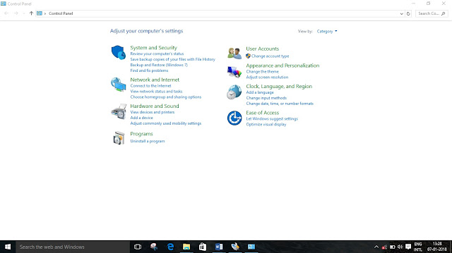   
2. Click on the `Network and Internet | Network and Sharing Centre | Change Adapter settings`.   
The following window will open.   
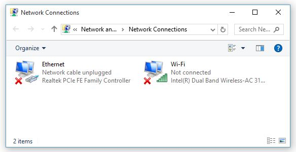   
3. Click on `Ethernet`. The following window will open.   
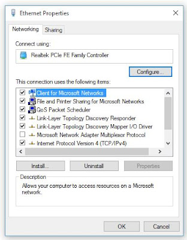   
4. Double click on Internet Protocol Version 4(TCP/IPv4)   
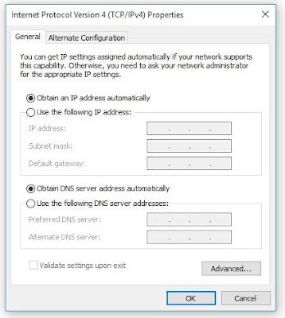   
5. Click on Use the following IP address and use the following IP address: `169.254.211.250`   
Subnet mask will automatically set.   
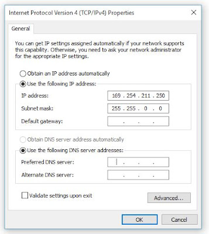   
6. Now click OK and close every thing.

#### Connecting the Raspberry pi to PC

Now just follow these steps to connect the Raspberry Pi to your PC.

1. Power up the Raspberry Pi using an micro USB cable and connect it to PC (or a 5 V supply).   
2. Now connect the PC and the Raspberry pi using a LAN cable. If the connection is proper the Tx-Rx led will start to glow.   
3. Now to set up the Raspbian OS on your PC you will require two other softwares – Xming and Putty.   
4. You can get both the softwares from https://xming.en.download.it/ and https://www.putty.org/ respectively.
5. Firstly Install the Xming software as usual next-next-install. Putty doesn't needs installation. It will directly run on your PC.
6. Now double click on Xming to open it. You will find nothing opens. Don’t worry Xming is a background app and runs in background.
7. Now open Putty.   
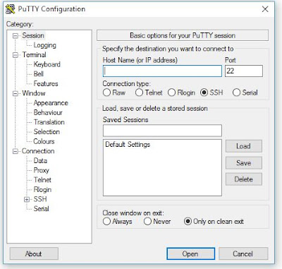   
8. In the `Sessions` tab specify the Host Name(or IP address) to `169.254.211.247`. Let all other settings at default.   
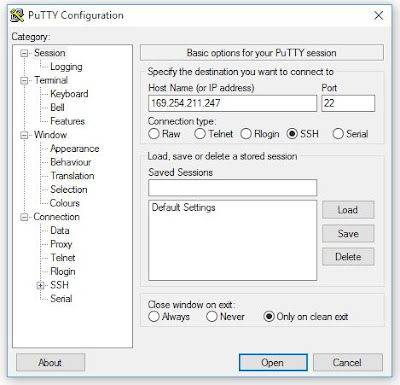   
9. In the category expand the `SSH` tab and select `X11` and check `Enable X11 forwarding`.   
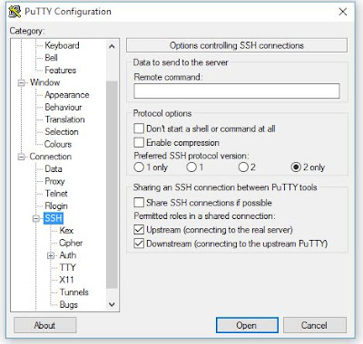  
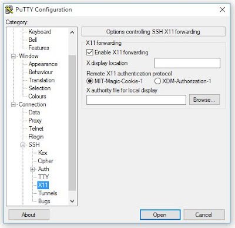     
10. Now click on `Open`. When you do so Raspbian OS will open. If this window opens means that yours OS is successfully installed.   
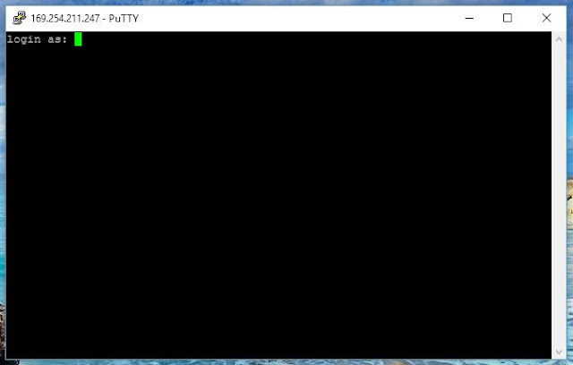   
11. In Login as enter `pi` which is default user name and press enter.    
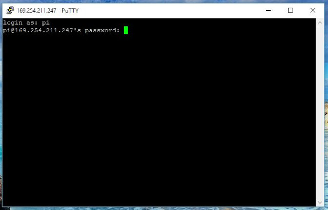   
12. In the password enter `raspberry` which is again by default. Note that the password you enter will not be visible. Now press enter.   
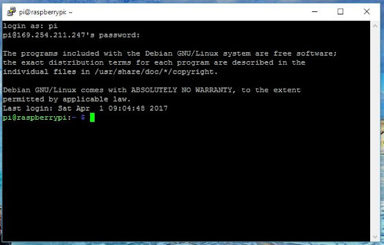    
13. Once the loading is done and you find the cursor, write the command `startlxde` and then press enter.   
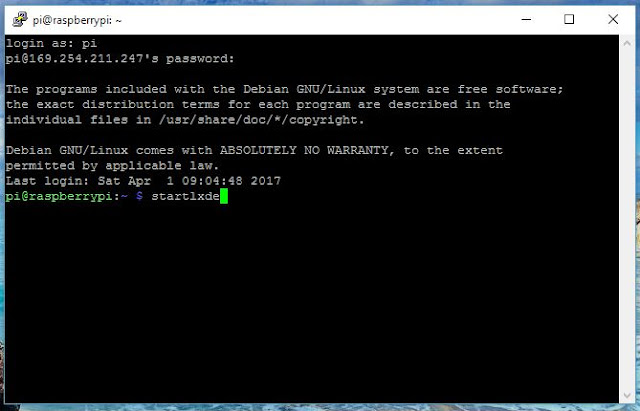    
14. Once you press enter the following window will open.   
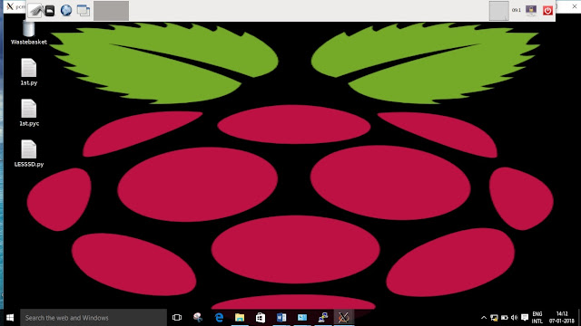   

It is as an another OS at the top of my Windows 10. This is achieved using Xming. You can explore this OS for now till the next post on this.