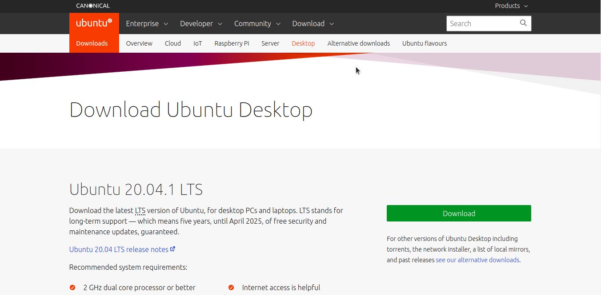

### What is Ubuntu?

**Ubuntu** is an open source linux based software operating system that runs from the desktop **(Ubuntu Desktop)**, to the cloud **(Ubuntu Server)**, to all your internet connected things.

<!-- truncate -->

### Why use Ubuntu?

**Ubuntu** comes with everything you need to run your organisation, school, home or enterprise. All the essential applications, like an office suite, browsers, email and media apps come pre-installed and thousands more games and applications are available in the Ubuntu Software Centre.

Ubuntu has always been free to download, use and share.

It comes with a built-in firewall and virus protection software due to which it is one of the most secure operating systems around. And the long-term support releases give you five years of security patches and updates.

Ubuntu is by far the most popular of the well known Linux distributions. Thus it has a large community providing extensive knowledge and solutions to most of the problems.

### How to get Ubuntu?

As mentioned earlier, Ubuntu is always free to download and the latest LTS version at the time of writing of this blog is Ubuntu 20.04.

You can download the OS from the official site - https://ubuntu.com/download and replace your current OS with it or run Ubuntu alongside it.

For desktop PCs and laptops download the Ubuntu Desktop image from https://ubuntu.com/download/desktop

Once you have downloaded the .iso image file for the OS, you can simply install the OS by replacing the old one or install it along side other OS such as Windows by using dual boot or Virtual Machine Softwares.

