### Dual Boot or VMware?

Depending on the work or requirements of a particular assigned task, one may require a specific operating system or a specific version of an operating system (eg. Linux or Windows 7 or Windows 10).
<!-- truncate -->

To install multiple copies of different OS on a machine there are two ways: Dual Boot or use a VMware software.

### Why use Dual Boot?

In case of dual boot the system hardware is completely dedicated to the particular OS. 

Simply consider your PC has a 4 GB of RAM and 1 TB of Hard disk space. In case of dual boot the the OS you are running will be able to use full available RAM improving high performance tasks experience.

In Virtual Machine Software you use one OS on top of another, thus dividing the available RAM among these two OS. 

It is preferable to use dual boot, if your system lacks high speed hardwares and you are to be working on the selected OS for a longer duration.

In case you just need to use the OS for a small work or quick tasks, VMware is recommended.

### Dual Boot Ubuntu alongside Windows 10

#### Step 1 : Create a partition for Ubuntu OS

To install Ubuntu on your computer you need to set aside some free space on the hard disk. The recommended system requirements for Ubuntu 20.04 LTS are: 

- 2 GHz dual core processor or better
- 4 GB RAM
- 25 GB of free hard drive space

In most windows PC the hard disk is majorly partitioned into 

- OS (C:) drive -  Windows system and OS files are installed here
- D: drive, E: drive ,etc - Mainly for personal storage purpose (Optional)

In this step we have to create such one partition to install the Ubuntu OS and to store its system files

- Login to your windows system and open Disk Management     
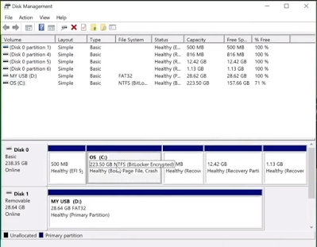
- In above window there is a OS (C:) partition which is of 223.50 GB of disk space ( sizes will vary according to system ). Ubuntu requires minimum 25 GB of free disk space. Here I will use 50 GB of the available space for the OS installation.
- Right Click on the OS (C:) drive partition and select Shrink Volume.      
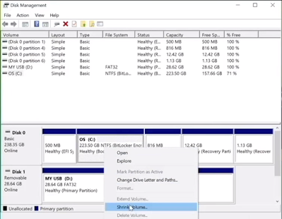
- After clicking Shrink Volume the following window will open      
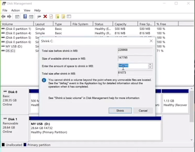
- In the input for column Enter the amount of space to shrink in MB enter 50000 and then click on Shrink button. 
- Once done you will be able to see a Unallocated 50 GB partition which we will be using to install Ubuntu.      
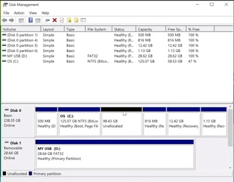

#### Step 2 : Creating an Installer Media

Before proceeding further make sure you have downloaded the following softwares and have the necessary hardware ( USB drive / Pendrive - minimum 8 GB )

1. Ubuntu .iso Image File ([Download](https://ubuntu.com/download/desktop))
2. SD Memory Card Formatter Software ([Download](https://www.sdcard.org/downloads/formatter/eula_windows/index.html))
3. Balena Etcher Software ([Download](https://www.balena.io/etcher/))

Once you have all the necessaries, you can connect the pendrive to the windows PC.

**A. Formatting the USB Drive**

Launch the SDFormatter application, once you have downloaded and installed the SD formatter from given download link. The following window will open.      
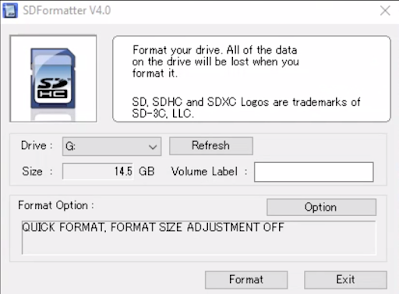

Click on Option and select FORMAT TYPE as FULL (Erase) and then select OK   
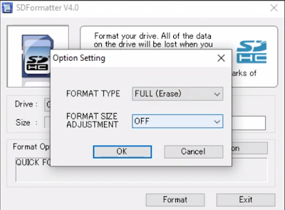

Now click on Format. Once done we can proceed to the next step.😎    
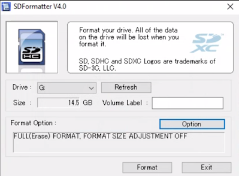

**B. Creating the installer media**

Launch BalenaEtcher and you will see the following window opens    
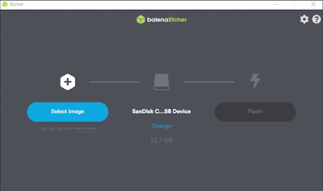

Click on Select image and browse to the location where you have saved the Ubuntu .iso image file.   
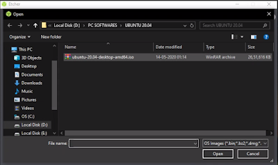

Select the .iso file and click Open.

You should now select the USB device (if its not already selected) on which you need to write the OS.   
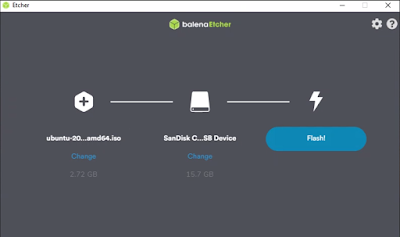

Now click on Flash! and wait for the process to complete.   
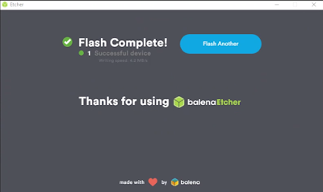

Your installer media is ready! 