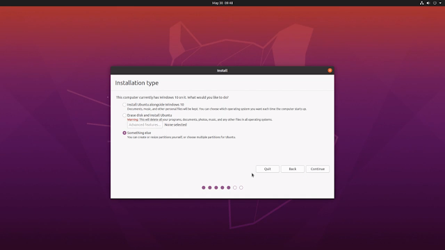

We have completed the following steps in the previous blog [Dual Boot Ubuntu Alongside Windows 10 - Part 1](/blog/dual-boot-ubuntu-p1)

***Step 1 : Create a partition for Ubuntu OS***    
***Step 2 : Creating an Installer Media***

Now we will proceed with the installation of Ubuntu in the next step...

<!-- truncate -->

#### Step 3 : Installing Ubuntu with Dual boot on Windows 10

In the last steps we have created an installer media using the USB drive. We will use the installer media now to install Ubuntu.

Connect the USB drive / pen-drive to the PC and power ON the PC (Note: If you are already logged in to Windows simply connect the pen-drive to PC and restart your PC)

While the PC is starting press F12 continuously to open the boot menu (The keys to access boot menu varies according to brand, F12 is boot menu key for Dell and Lenovo, F10 for HP) 

Once on the boot menu screen you can select your USB device from the list of available boot devices.

After selecting your USB device press Enter to boot into Ubuntu. If a grub screen as shown in following figure appears select Try Ubuntu without installing

It will take some time to boot into the OS after which the following screen will appear. You can click on Try Ubuntu to get the feel of the OS before actually installing it or you can directly proceed to install the OS by clicking Install Ubuntu.

After clicking on Install Ubuntu the following screen will open. Select your keyboard layout and click on Continue.

In the next screen you will need to select the apps to install while installing Ubuntu.

For Normal Installation it will install all softwares for web browsers, utilities, office softwares, games and media players. 

Select Minimal Installation if you do not need more software or are short in space. ( Note: You can install these softwares later if  required )

Here we will proceed with Normal Installation

Un-check Other Options i.e Download updates while installing Ubuntu and Install third-party software and click on Continue

Next you need to select the Installation type

Select Something else from the available options and click Continue. This gives us the freedom to make our own partitions and allocate space as per our needs.

The next window we need to create partitions for our installation.

From the available partitions select the free space partition. Its nearly 50 GB of free space. 

We will be creating two partitions from the available 50 GB space: 

- The root (/) partition (same as C: Drive in windows)
- The swap partition (Its like an extra RAM, its a partition that works as a RAM when the original RAM memory is fully utilised. The recommended swap memory size ~ 2 * RAM size)

You can also add the Home partition (as D: and E: drives in Windows) to properly organise your system files. But I will skip that here.

Once you have selected the free space partition click on the plus ( + ) icon on the window. This will open a Create Partition window.

We will first create the root partition.

Enter the size of the partition as 40000 MB, select the type as Logical and location as Beginning of this space.  Use as : Ext4 journaling file system

Select the mount point as (/) i.e root and click on OK. This will create the root partition.

Next we will add the swap partition. 

Select the available free space partition and click on plus ( + ) icon. This will again open the Create Partition window.  

Enter the size of the partition as 8000 MB, select the type as Logical and location as Beginning of this space.  Select Use as : swap area and click OK. 

Hence we are done with creating the root and swap partition. Now you can click Install Now

A confirmation window will pop up. Click on Continue to proceed with the installation. 

Before starting the installation you need to enter some details..

Select your time zone and click Continue

Enter your login details and click on Continue

Now your installation will begin. This will take some time.

Once the installation is complete you can restart the computer by clicking Restart Now

After restarting your computer you will now see a grub screen from where you can choose between the two OS. Select Ubuntu to boot into Ubuntu OS and select Windows Boot Manager to boot into Windows 10.

This completes the installation of Ubuntu alongside Windows 10.😎 