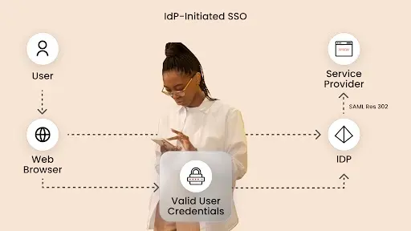

Single Sign-On (SSO) is a user authentication process that allows individuals to log in once and access multiple applications without needing to re-enter credentials. SAML (Security Assertion Markup Language) is one of the most widely used protocols for implementing SSO. When deploying SSO using SAML, there are two primary methods: **IdP-Initiated Login** and **SP-Initiated Login**.
<!-- truncate -->

## What is IdP-Initiated Login?

In an IdP-Initiated login flow, the authentication process begins at the **Identity Provider (IdP)**. The steps involved are:
1. The user accesses the IdP’s login page and enters their credentials.
2. The IdP verifies the credentials and generates a **SAML Response**.
3. The IdP sends the SAML Response directly to the **Service Provider (SP)**.
4. The SP processes the SAML Response, validates the signature, and logs the user in.

**Advantages of IdP-Initiated Login:**
- The user can access multiple applications from a centralized portal.
- No need for the SP to generate an authentication request.
- Ideal for scenarios where the IdP controls user authentication.

**Challenges:**
- SPs must trust the SAML Response without an authentication request.
- Security concerns if not properly implemented, as the SP does not initiate the session.

## What is SP-Initiated Login?

In an SP-Initiated login flow, the authentication process starts at the **Service Provider (SP)**. The steps involved are:
1. The user tries to access a protected resource on the SP.
2. The SP generates a **SAML Authentication Request** and redirects the user to the IdP.
3. The IdP authenticates the user and generates a **SAML Response**.
4. The IdP redirects the user back to the SP with the SAML Response.
5. The SP validates the response and grants access.

**Advantages of SP-Initiated Login:**
- The SP has control over when authentication should happen.
- Helps prevent unauthorized access since authentication requests are always initiated by the SP.

**Challenges:**
- Requires additional setup and configurations on both IdP and SP.
- More steps compared to IdP-Initiated login, potentially causing delays.

## Which SSO Technique Should You Choose?

Choosing between IdP-Initiated and SP-Initiated login depends on your use case:
- **If you need centralized authentication and access to multiple applications from a portal, use IdP-Initiated Login.**
- **If security and access control are crucial, and authentication should always start at the SP, use SP-Initiated Login.**

## Final Thoughts

Both IdP-Initiated and SP-Initiated logins have their own advantages and limitations. Organizations should evaluate their security requirements and user experience needs when deciding which approach to implement. With proper implementation, SAML SSO enhances security, reduces login fatigue, and improves user productivity.

## Reference
This blog post is based on information from [miniOrange](https://www.miniorange.com/blog/idp-initiated-sp-initiated-login/)