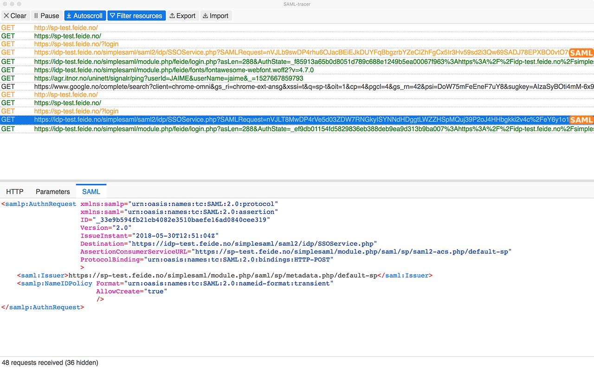

In today's world of web applications, security and seamless user authentication are paramount. Single Sign-On (SSO) solutions are becoming the standard method for managing user access to multiple applications. One of the most widely adopted protocols for SSO is **SAML** (Security Assertion Markup Language). SAML allows for the secure exchange of authentication and authorization data between Identity Providers (IdPs) and Service Providers (SPs).

<!-- truncate -->

Developing SSO applications and working with SAML responses requires specific tools to ensure that all aspects, from key generation to testing valid responses, are correctly implemented. In this post, I will share the essential tools I use to develop, generate, and test valid SAML responses, as well as improve the overall development process.

## 1. OpenSSL for Windows

### What is OpenSSL?

**OpenSSL** is a comprehensive toolkit that implements SSL and TLS protocols. It also provides a robust suite of cryptographic functions, including the ability to generate public and private keys for encryption and digital signing. These keys are crucial for the signing and verification of SAML assertions.

### Why Do I Use OpenSSL?
For developing SSO applications, you need to generate keys (private and public) to sign and verify SAML assertions. OpenSSL allows you to generate these keys securely and manage their lifecycle.

### How OpenSSL Helps:
- **Private key generation**: You can use OpenSSL to generate a private key that will sign your SAML assertions.
- **Public key generation**: From the private key, you can derive the corresponding public key, which will be shared with your Service Provider (SP) for verification purposes.
  
### How to Get It:
To install OpenSSL on Windows, you can use the Win32/Win64 OpenSSL Installer from the official website. This installer comes with precompiled binaries, making it easy to get up and running without worrying about manual compilation.

You can download it from here: [Win32 OpenSSL](https://slproweb.com/products/Win32OpenSSL.html)

---

## 2. Generating RSA Keys with OpenSSL

### What are RSA Keys?
**RSA** (Rivest-Shamir-Adleman) is an asymmetric encryption algorithm widely used for securing sensitive data, particularly in digital signatures. In the context of SSO, RSA keys are used to sign and verify SAML assertions.

### Why Use RSA Keys for SSO?
SAML relies on digital signatures to ensure the authenticity of authentication data. The **private key** is used to sign the SAML assertions, while the **public key** is used by the Service Provider to verify the authenticity of the assertions.

### Generating RSA Keys:
Here is where Scott Brady's guide comes in. His blog provides an easy-to-follow guide on how to generate RSA keys using OpenSSL.

- **Step 1**: Generate the RSA private key.
    ```
    openssl genrsa -out private-key.pem 3072
    ```
- **Step 2**: Derive the corresponding public key from the private key.
    ```
    openssl rsa -in private-key.pem -pubout -out public-key.pem
    ```
Having both the public and private keys is essential for generating and verifying SAML assertions.

You can check out the guide here: [Creating RSA Keys with OpenSSL](https://www.scottbrady.io/openssl/creating-rsa-keys-using-openssl)

---

## 3. SAML Tracer Chrome Extension

### What is SAML Tracer?
The **SAML Tracer** is a Chrome extension that allows you to intercept and view SAML messages exchanged between your browser and the identity or service provider.   



### Why is SAML Tracer Useful?
SAML messages are typically passed in the background between the browser and the SSO infrastructure. As a developer, it’s important to inspect these messages to ensure that everything is functioning correctly. The SAML Tracer enables you to:
- Capture SAML requests and responses.
- View the SAML assertions that are sent to and received from the IdP.
- Debug issues with the authentication flow by inspecting the raw SAML messages.

With real-time analysis, you can verify that your SSO setup is working as intended, making this tool indispensable for SAML debugging.

You can download it from the Chrome Web Store: [SAML Tracer](https://chromewebstore.google.com/detail/mpdajninpobndbfcldcmbpnnbhibjmch?utm_source=item-share-cb)

---

## 4. SAMLTool.com

### What is SAMLTool.com?
[SAMLTool.com](https://www.samltool.com/) is an online suite of tools for working with SAML messages. It provides a variety of utilities to help developers manage, test, and troubleshoot SAML assertions and responses.

### Key Features:
- **Decode and Encode SAML**: You can decode base64-encoded SAML assertions and encode them back for testing.
- **Sign and Validate SAML**: It provides tools to digitally sign and validate SAML assertions using your keys.
- **Generate Metadata**: SAMLTool can help generate and validate SAML metadata for both IdPs and SPs.
- **Encryption and Decryption**: It also allows for the encryption and decryption of SAML messages, ensuring that sensitive data remains secure during transit.

This tool is highly useful for:
- Testing the structure of your SAML assertions.
- Validating if the assertions are correctly signed and encrypted.
- Quickly debugging issues in SSO integrations.

You can visit SAMLTool here: [SAMLTool.com](https://www.samltool.com/)

---

## Conclusion

Building secure and efficient Single Sign-On (SSO) systems using SAML requires the use of specialized tools. Whether you are generating RSA keys for signing assertions, inspecting SAML requests and responses, or validating your SAML responses, these tools will ensure that your SSO application works smoothly.

- **OpenSSL** for generating and managing keys.
- **Scott Brady's Guide** for creating RSA keys using OpenSSL.
- **SAML Tracer** Chrome extension for intercepting and inspecting SAML messages.
- **SAMLTool.com** for testing and validating SAML responses.

Incorporating these tools into your development process can significantly streamline the creation, testing, and validation of SSO applications. By ensuring the integrity and validity of your SAML responses, you can guarantee a secure and efficient user authentication experience. Happy coding!