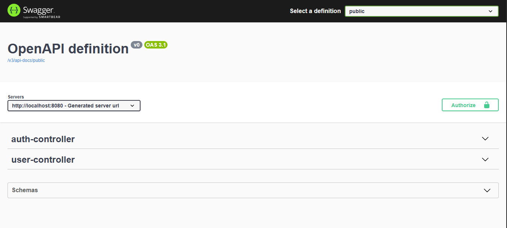

In a secure REST API, it's important to authenticate requests — especially when using **JWT tokens**. When integrating Swagger UI using `springdoc-openapi`, we can also configure it to include a **JWT Authorization header** so developers can test secured endpoints easily.

In this tutorial, we’ll walk through how to configure **JWT Bearer Authorization in Swagger UI** step by step.
<!-- truncate -->

## Prerequisites

You should have a working Spring Boot application secured with **Spring Security** and **JWT authentication** already implemented.

## Step 1: Add Swagger/OpenAPI Dependency

Add the `springdoc-openapi` dependency to your `pom.xml`:

```xml
<dependency>
    <groupId>org.springdoc</groupId>
    <artifactId>springdoc-openapi-starter-webmvc-ui</artifactId>
    <version>2.8.6</version>
</dependency>
```

This enables auto-generation of OpenAPI docs and the Swagger UI at `/swagger-ui.html`.

## Step 2: Create Swagger Configuration Class

The configuration file tells Swagger to use the **JWT Bearer** scheme for authorization.

### `SwaggerConfig.java`

```java
package com.example.pharmacy_management_server.config;

import io.swagger.v3.oas.annotations.enums.SecuritySchemeType;
import io.swagger.v3.oas.annotations.security.SecurityScheme;
import org.springdoc.core.models.GroupedOpenApi;
import org.springframework.context.annotation.Bean;
import org.springframework.context.annotation.Configuration;

// Define a security scheme for JWT Authorization in Swagger
@SecurityScheme(
    name = "Authorization",                // Name used in @SecurityRequirement
    type = SecuritySchemeType.HTTP,       // HTTP auth type
    bearerFormat = "JWT",                 // Indicate it's a JWT token
    scheme = "bearer"                     // Use the bearer authentication scheme
)
@Configuration
public class SwaggerConfig {

    // Group all APIs under "public" and expose all routes
    @Bean
    public GroupedOpenApi publicApi() {
        return GroupedOpenApi.builder()
                .group("public")
                .pathsToMatch("/**")
                .build();
    }
}
```

## Step 3: Secure Specific Endpoints

Now, for any endpoint you want to protect with JWT and require users to authorize via Swagger UI, annotate the controller method or class with `@SecurityRequirement`.

### Example: UserController

```java
package com.example.pharmacy_management_server.controller;

import com.example.pharmacy_management_server.model.User;
import com.example.pharmacy_management_server.service.UserService;
import io.swagger.v3.oas.annotations.security.SecurityRequirement;
import org.springframework.http.ResponseEntity;
import org.springframework.security.core.annotation.AuthenticationPrincipal;
import org.springframework.security.core.userdetails.UserDetails;
import org.springframework.web.bind.annotation.*;

import java.util.UUID;

@RestController
@RequestMapping("/api/users")
public class UserController {

    private final UserService userService;

    public UserController(UserService userService) {
        this.userService = userService;
    }

    // Secure this endpoint with JWT token in Swagger UI
    @SecurityRequirement(name = "Authorization")
    @GetMapping("/{userId}")
    public ResponseEntity<User> getUserById(
            @PathVariable UUID userId,
            @AuthenticationPrincipal UserDetails userDetails
    ) {
        if (userDetails == null) {
            return ResponseEntity.status(403).build();
        }

        User user = userService.getUserById(userId);
        return ResponseEntity.ok(user);
    }
}
```

**Explanation:**

- `@SecurityRequirement(name = "Authorization")`:  
  This tells Swagger that this endpoint requires a JWT token using the `"Authorization"` scheme defined earlier.

- When users try this endpoint from Swagger UI, they will see an **Authorize** button. Once they enter their token (e.g., `Bearer eyJhbGciOi...`), Swagger will include it in the `Authorization` header for all secured endpoints.

## Step 4: Testing in Swagger UI

Once everything is set up:

1. Go to: `http://localhost:8080/swagger-ui.html`  
2. Click the **Authorize** button at the top-right     
   
3. Enter your JWT token:  
   ```
   Bearer eyJhbGciOiJIUzI1NiIsInR5cCI6IkpXVCJ9...
   ```
4. Try calling secured endpoints — the `Authorization` header will now be automatically included.

## Conclusion

Adding JWT authorization to Swagger UI helps you test your secure endpoints without using external tools like Postman. By defining the security scheme and annotating secured endpoints properly, you can integrate token-based authentication smoothly into the developer experience.
