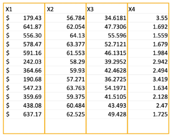
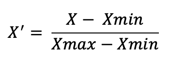
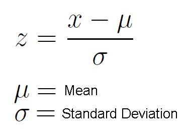
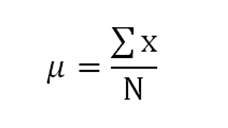
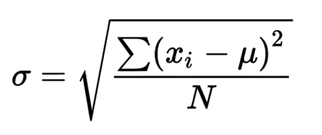

# Pre-requisites

## Training Set & Test Set

The training-test split is a important concept in machine learning and plays an essential role in evaluating the performance of a model.

Generally we use the 80/20 split, where the ML model is trained on 80% of the data set and the remaining 20% of the data set is used to evaluate the performance of the model in real world.

## Feature Scaling

Feature Scaling generally applies across columns in a given dataset. 

For example consider the following table   

In the above dataset, each column has a different scale or range of values, which is why feature scaling is needed. Let's break down what this means and why it's important:

- x1 values (in dollars) can range from low to high amounts, making this feature larger in scale compared to the others.
- x2 values range between 55 to 65, which is a smaller range than x1.
- x3 values range between 35 to 55, which is a little higher than x2 but still smaller than x1.
- x4 values range from 1 to 4, which is the smallest range of all the features.

### Why Feature Scaling Is Important Here:

When these features are input into a machine learning model, the model might give more importance to the feature with the larger range (like x1), even if the other features are just as important. This can cause problems because:

- A model might overemphasize the effect of x1 (dollars), while underemphasizing other features like x2, x3, and x4.
- Feature scaling helps to make all features equally important by adjusting them to a similar scale, so that the model can learn from all the features fairly.

### How to Apply Feature Scaling:

#### 1. Normalization (Min-Max Scaling):

Normalization transforms the data so that all the values in a feature fall within a specific range, usually between 0 and 1.

It makes sure that all features are on the same scale, preventing any one feature from dominating the model because of its larger range.

Rescales the values to be between 0 and 1, great when the data has varying ranges or when you're dealing with algorithms sensitive to distance

***Formula:***   

#### 2. Standardization (Z-Score Scaling):

Standardization scales the data so that each feature has a mean of 0 and a standard deviation of 1. This is often useful when the data has a normal (bell-shaped) distribution.

It helps when you have features with different units or different ranges and you need to make sure that all features are treated equally by the model.

Centers the data around 0 with a spread of 1, useful when the data has a normal distribution and when the features vary in scale but you want them to have a consistent impact on the model.

***Formula:***   

Here,   
**Mean** is    
   
and **Standard Deviation** is   
