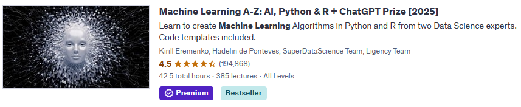

# Documentation Overview

## Udemy Course: [Machine Learning A-Z: AI, Python & R](https://www.udemy.com/share/101Wci/)
This section covers notes from the **Machine Learning A-Z: AI, Python & R** course on Udemy by **Kirill Eremenko, Hadelin de Ponteves, SuperDataScience Team, Ligency Team**.

