# Creating beans inside Spring Context 

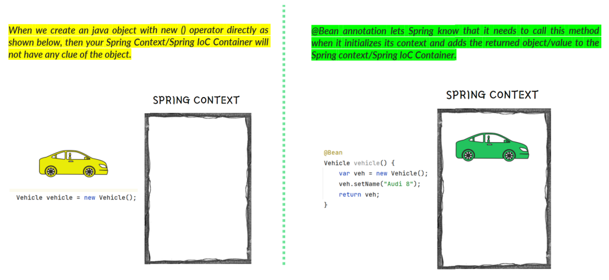

## Understanding NoUniqueBeanDefinitionException

When we create multiple objects of same type and try to fetch the bean from context by type, then Spring cannot guess which instance you've declared you refer to. This will lead to `NoUniqueBeanDefinitionException` like shown below, 

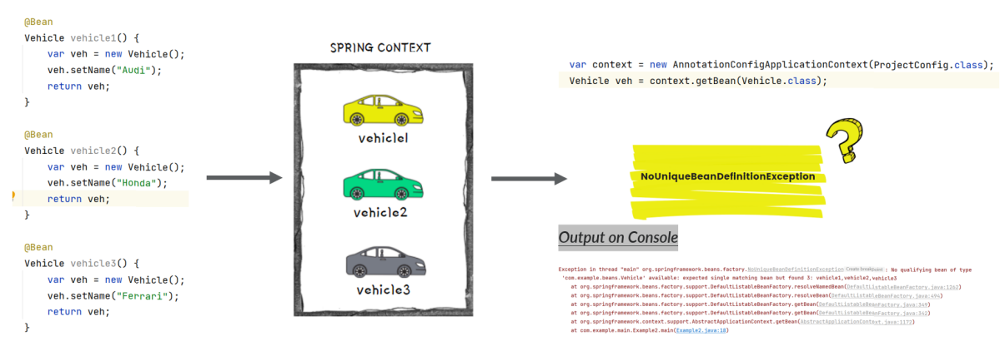

To avoid `NoUniqueBeanDefinitionException` in these kind of scenarios, we can fetch the bean from the context by mentioning it’s name like shown below, 

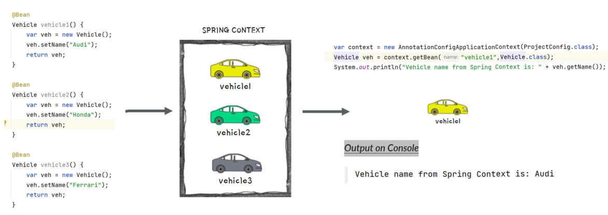

## Different ways to name a bean

By default, Spring will consider the method name as the bean name. But if we have a custom requirement to define a separate bean name, then we can use any of the below approach with the help of @Bean annotation, 

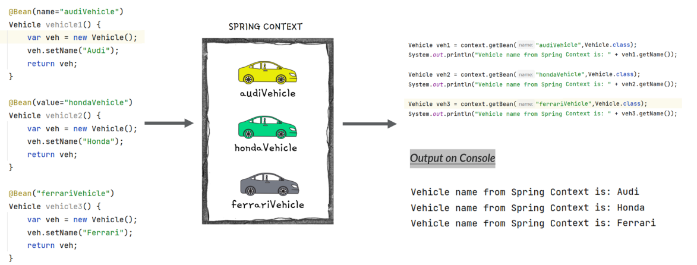

## Understanding @Primary Annotation inside Spring

When you have multiple beans of the same kind inside the Spring context, you can make one of them primary by using `@Primary` annotation. 

Primary bean is the one which Spring will choose if it has multiple options and you don’t specify a name. In other words, it is the default bean that Spring Context will consider in case of confusion due to multiple beans present of same type.

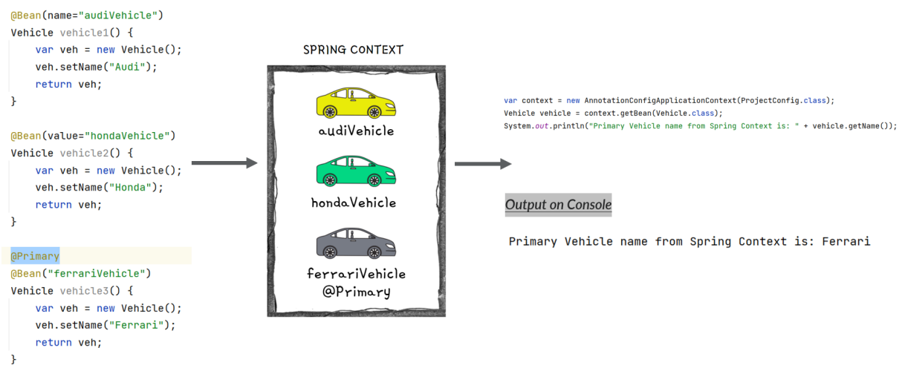

## Creating Beans using @Component annotation

`@Component` is one of the most commonly used stereotype annotation by developers. 

Using this we can easily create and add a bean to the Spring context by writing less code compared to the `@Bean` option. 

With stereotype annotations, we need to add the annotation above the class for which we need to have an instance in the Spring context. 

Using `@ComponentScan` annotation over the configuration class, instruct Spring on where to find the classes you marked with stereotype annotations. 

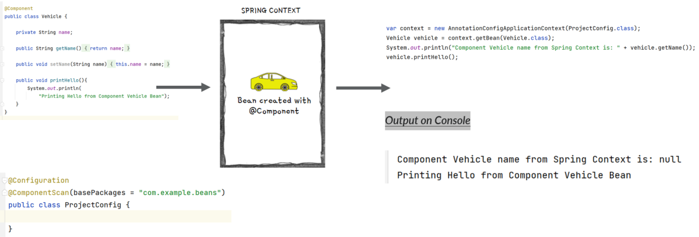

## Spring Stereotype Annotations

Spring provides special annotations called **Stereotype annotations** which will help to create the Spring beans automatically in the application context. 

The stereotype annotations in spring are @Component, @Service, @Repository and @Controller.

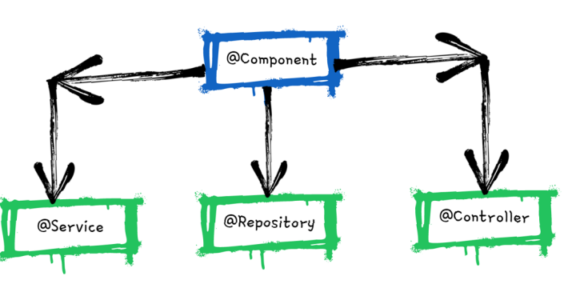

- `@Component` is used as general on top of any Java class. It is the base for other annotations.
- `@Service` can be used on top of the classes inside the service layer especially where we write the business logic and make external API calls.
- `@Repository` can be used on top of the classes which handles the code related to Database access related operations like Insert,  Update, Delete etc.
- `@Controller` can be used on top of the classes inside the Controller layer of MVC applications.

## @Bean Vs @Component 

| @Bean | @Component |
|---|---|
|One or more instances of the class can be added to the Spring Context |Only one instance of the class can be added to the Spring context |
|We can create an object instance of any type of class including present inside libraries like Spring etc. | We can create an object instance for application class only which are created by Dev team |
| Usually we need to write more code like separate methods to create beans instances  | Bean instances can be created with very less code like using @Component on top of the class |
| Developer will have full control in creating and configuring the bean | Developer will not have any control in creating and configuring the bean |
| Spring framework creates the bean based on the instructions and values provided by Developer | Spring framework takes charge of creating the bean and post that Developer will have access to it |

## @PostConstruct Annotation 

We have seen that when we are using stereotype annotations, we don’t have control while creating a bean. But what if we want to execute some instructions post Spring creates the bean. For the same, we can use `@PostConstruct` annotation.

We can define a method in the component class and annotate that method with `@PostConstruct`, which instructs Spring to execute that method after it finishes creating the bean.

Spring borrows the `@PostConstruct` annotation from Java EE.

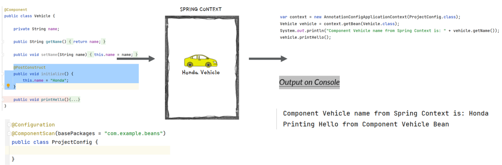

## @PreDestroy Annotation 

`@PreDestory` annotation can be used on top of the methods and Spring will make sure to call this method just before clearing and destroying the context. 

This can be used in the scenarios where we want to close any IO resources, Database connections etc. 

Spring borrows the `@PreDestory` annotation also from Java EE.

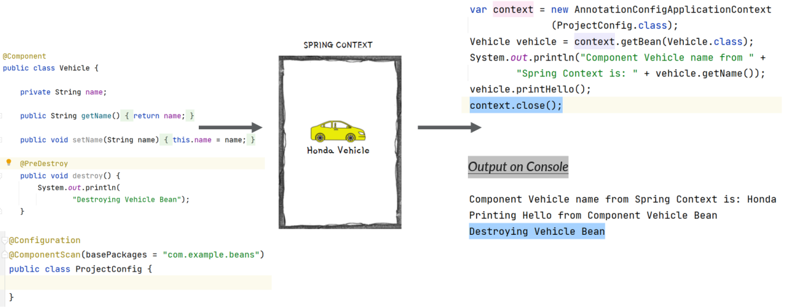

## Adding New Beans programmatically

Sometimes we want to create new instances of an object and add them into the Spring context based on a programming condition. 

For the same, from Spring 5 version, a new approach is provided to create the beans programmatically by invoking the `registerBean()` method present inside the context object. 

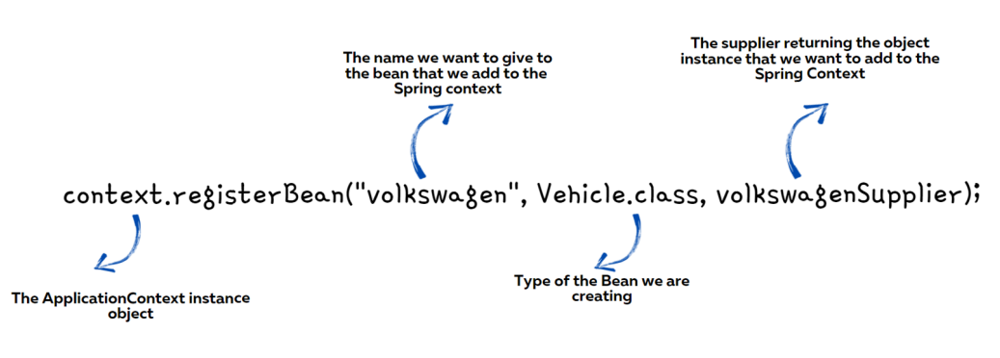

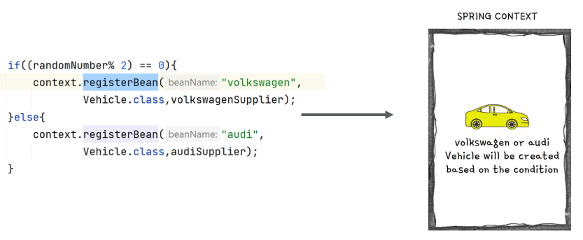

## Adding new beans using XML Configs

Inthe initial versions of Spring, the bean and other configurations used to be done using XML. But over the time, Spring team brings annotation based configurations to make developers life easy. Today we can see XML configurations only in the older applications built based on initial versions of Spring. 

It is good to understand on how to create a bean inside Spring context using XML style configurations. So that, it will be useful if ever there is a scenario where you need to work in a project based on initial versions of Spring. 

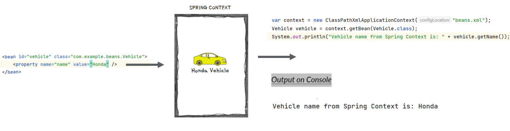