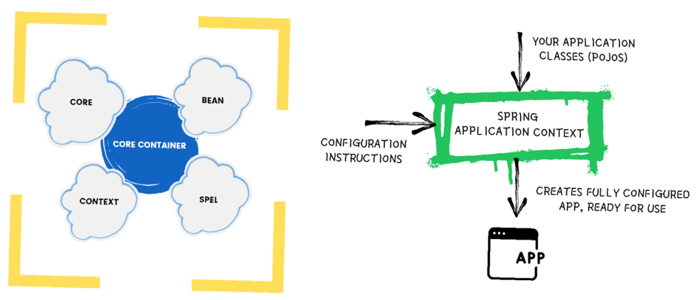

# Introduction to Spring IoC Container

## Spring loC Container 

The IoC container is responsible 
- to instantiate the application class 
- toconfigure the object 
- to assemble the dependencies between the objects 

There are two types of loC containers. They are: 
- `org.springframework.beans.factory.BeanFactory` -> Basic IoC Container
- `org.springframework.context.ApplicationContext` -> Advanced IoC Container

The Spring container uses dependency injection (Dl) to manage the components/objects that make up an application. 

