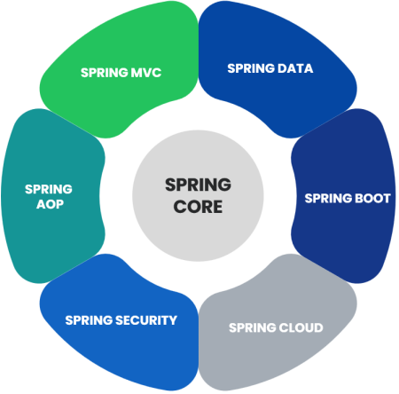

# Introduction to Spring Core

Spring Core is the heart of entire Spring. It contains some base framework classes, principles and mechanisms.

The entire Spring Framework and other projects of Spring are developed on top of the Spring Core. 

Spring Core contains following important components, 

- IoC (Inversion of Control) 
- DI (Dependency Injection) 
- Beans 
- Context 
- SpEL (Spring Expression Language) 
- IoC Container 

